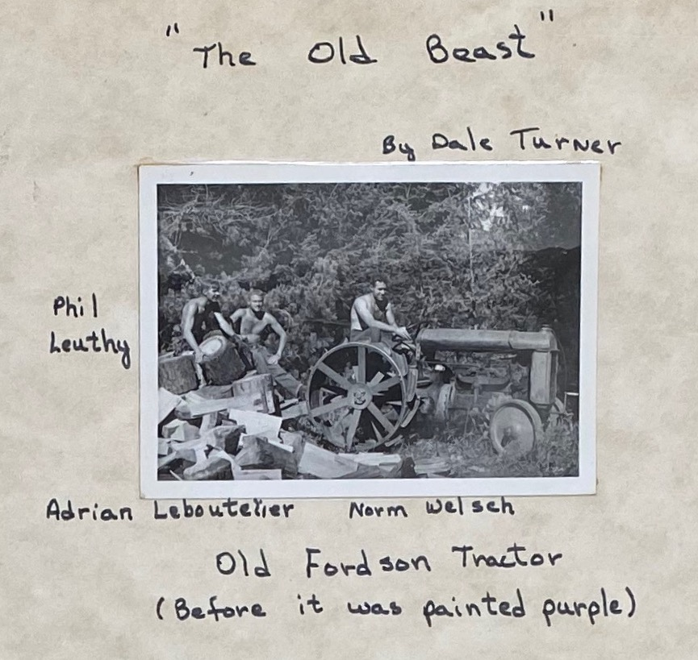

# Beast
### Names

- Beast
- the tractor
- The Old Beast

### Description

The old Fordsen tractor that powered [Mach](Mach) when first built in 1938. In the summer the Beast would be released from his foundation to haul supplies. Replaced by a Chevy engine in 1946, the Beast hauled supplies until one winter the block froze and burst. The beast was finally taken away by a junk dealer from Roslyn, who prosed to make a statue out of it. [nw][]

### History

#### 1941

New coils were installed in the generator and a new axle was provided for the tractor which we hope will result in a trouble-free season for the coming year. [ma41][]

#### 1943

The tow tractor was given a thorough overhaul. [ma43][]

## 1946

Rebuilt rope tow machinery. Discarded Fordson; replaced with Chevy truck engine and transmission and truck rear end. For driving wheels used wood rims originally mounted on Fordson tractor drive wheels. [ma78][]

## 1951

With the faithful aid of the "Beast" (our beloved Fordson Tractor), which draws our antiquated trailer. [ma51][]

#### 1952

A special award of merit has been awarded to the tractor which had been retired years ago to be a tow motor and is now a tractor again, running on some mysterious, magical ingredient, and nursed tenderly by Norm Welch to perform prodigious feats of strength for its advanced age. [ma52][]

#### 1953

My first introduction to Mountaineers, other than car companions, was upon joining six weary and drenched fellows standing around a Smithsonian model Fordson tractor which they claimed would run, but looked to me as though it should have been melted up some time before I was born. Every automotive theory I had ever heard was being advanced as to why it wouldn't start...After an hour or so our work was interrupted by a loud noise which sounded like something between a steam locomotive and a drag saw charging through the brush. To my utter amazement, the tractor appeared carrying out its much needed task. [ma53][]

#### 1984

This was the old Fordsen tractor that powered the [Mach](Mach) Tow when first built in 1938. In the summer the Beast would be released from his foundation to haul supplies. Finally replaced by a Chevy engine, the Beast continued to haul supplies until one winter someone failed to drain the block which froze and burst, and the beast was pushed to an unceremonious burial in the old can dump. It was finally taken away by a junk dealer from Roslyn, who prosed to make a statue out of it. [nw][]

[ma41]: Mountaineer-Annual#1941
[ma43]: Mountaineer-Annual#1943
[ma51]: Mountaineer-Annual#1951
[ma52]: Mountaineer-Annual#1952
[ma53]: Mountaineer-Annual#1953
[ma78]: Mountaineer-Annual#1978
[nw]: Names-Walt "Meany Names by Walter Little, 1984"
