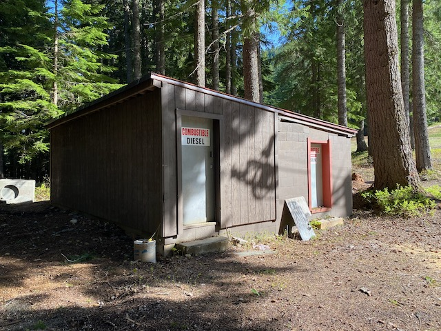
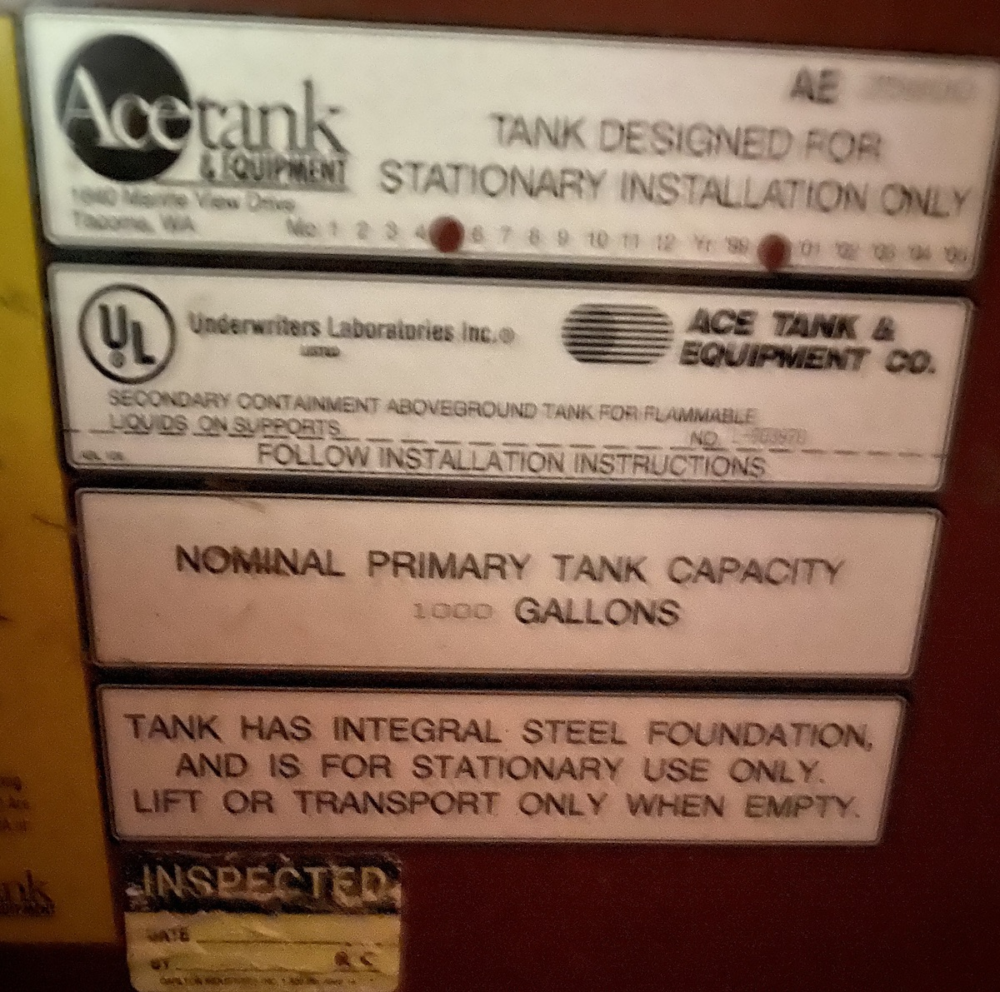

# Diesel Hut

### Names
* Diesel Hut
* Fuel House

### Location
Behind the [Tow Hut](/Building/Tow-Hut).

### Purpose
- Store diesel for Meany's diesel equipped machines. As of 2020, that list is [Hippo](/Machine/Hippo) and [Moose](/Machine/Moose).
- Store gasoline for Meany's gasoline burning machines other than TomCat. TomCat fills up at [Gas Hut](/Building/Gas-Hut) nearer the lodge. Gasoline stored out here is vestigial from When [Mach](/Mach) was a gas powered engine. Now that Mach is an electric motor, this tank is used for smaller machines like the wood splitter and snowmobiles.
- Store other machinery used on the campus, like the wood splitter.

### Specifications
- Diesel tank: 1,000 gallons [20]
- Gasoline tank: 500 gallons [20]
- tank diameters: ~48" OD, 46" ID (measured with stick) [20]
- tank Lengths: ~6' for 500 gallon, ~12' for 1,000 gallon

---
### History

#### 1989

Because of new code restrictions against buried fuel tanks, dug up 2 buried 500 gallon gasoline tanks used by "Mach". Cleaned, painted and reinstalled near the [Tow Hut](/Building/Tow-Hut).[hw][]

#### 2003

**Fuel House**: Built in 2001, it has two rooms, one for a 1500 gallon diesel tank for [Dino](/Machine/Dino), the hill grooming machine, and the other houses the gas tank for the tow hut engine.[75th][]

#### 2020

The diesel hut has a 1,000 gallon diesel fuel tank and the adjacent gasoline tank is 500 gallons. The diesel tank was measured in reference to the gasoline tank (same diameter, twice as long) and after a stroke of obvious, by inspecting the tank plate on the far end of the tank which clearly states, "1,000 gallons".

[20]: #2020
[75th]: /Event/Anniversary#75th
[hw]: /History/Walt
