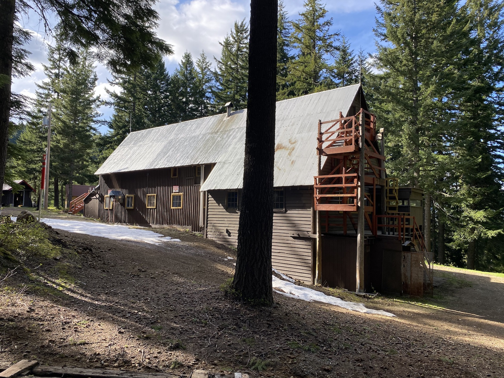

# Lodge
### Areas

* Basement
    * [Men's Room](/Lodge/Men's-Room)
    * [Ladies' Room](/Lodge/Ladies'-Room)
    * [Washroom](/Lodge/Washroom)
    * Shower #1
    * [Shower #2](Shower-2)
    * Drying Room
    * [Wood Room](/Lodge/Wood-Room)
    * [Tunnel](/Lodge/Tunnel)
    * [Jim](/Person/Jim-Fahey)'s Closet Under the Stairs
    * [Ping Pong Room](Ping-Pong-Room)
    * [First Aid Room](/Lodge/First-Aid-Room)
* First Floor
    * [Kitchen](/Lodge/Kitchen)
    * [Dining Room](/Lodge/Dining-Room)
    * [Commons](/Lodge/Commons)
* Second Floor
    * Women's Dorm
    * Men's Dorm
* Third Floor
    * [Third Peoples Dorm](Third-Peoples-Dorm)
    * Committee Dorm

### Reference

- [Floor Plan](https://raw.githubusercontent.com/MeanyLodge/meanylodge.github.com/assets/reference/2000-Lodge-Floor-plans.pdf)
- [Kitchen Floor Plan](https://raw.githubusercontent.com/MeanyLodge/meanylodge.github.com/assets/reference/2020-Kitchen-Floor-Plan.pdf)
- [Drolet Furnace Docs](https://raw.githubusercontent.com/MeanyLodge/meanylodge.github.com/assets/reference/2018-Drolet-Furnace.pdf)
- [Mattresses](https://github.com/MeanyLodge/Committee/wiki/Mattresses)

---
### History

#### 1928

Ernest's committee selected the Martin site and Dr. Edmond S Meany purchased it and donated it to the Mountaineers. Generous donations were made by the Everett and Tacoma branches. Materials were shipped by rail to Martin, unloaded by the enthusiastic volunteer workers and carried uphill 300 yards [ma78][] to the site by hand. Construction was started in September and dedicated on November 11.

Meany Ski Hut opened for skiing in the winter of 1928/29.

A frame building. One enters the front door and discovers a long, well lit spacious room with easy staircases running up either end to dorms on the second story. An open kitchen at the far side, tables and benches sprawl about the room and canvas-back easy chairs invite one to sit near the round-bellied heating stove. The lofty dorms have 52 spring double decker bunks and new mattresses. There are sinks with hot running water, mirrors aplenty and hooks to one's heart's content.[hut][]

outside 2-holers for Jane and John. [ma78][]

#### 1930

Added pantry to West end - 8'X20', one story, lean-to roof. [hw][]

#### 1939

Put finish flooring and inside lining in both new addition and old hut building. [hw][]

This summer it has been work, a total of 350 working weekends to build the fine 3-story, 24x30' addition on the east end. The hut has a large basement housing a furnace, drying room, waxing room and wash rooms.[ma39][]

Moved kitchen to west end. Added motor-generator set for electric lights. Added new furnace; and inside plumbing. Added wiring for electric lights in hut, replacing gasoline lanterns.[ma78][]

Being among the less talented, I was sent up on the roof to help with shingling, while other more experienced and artistic members such as Boyd Bucey designed and constructed the interior decor, including scalloped wooden valances over the windows and silhouettes of fir trees cut out of the shutters. The new addition included a basement with furnace in place of the former pot-bellied stove in the middle of the living room, drying and waxing rooms and best of all-at long last-indoor plumbing![ma91][]

#### 1944

Extended basement by digging under original portion of building. Constructed 10' x 10' drying room. [hw][], [ma44][]

#### 1950

Reshingled the roof.[ma50][]

#### 1952

the building of the fire wall and doors in the stairway; and that other fire preventative measures have been taken with extra hoses and kick-out doors, and emergency exits and lamps.[ma52][]

#### 1956

Deepest snow year at 15' on the level.

#### 1966

Re-roofed hut with corrugated galvanized iron to replace worn original cedar shingles. [ma78][], [hw][]

#### 1967

A new septic tank and sewer system were installed. The hut's foundation was replaced, and so was the roof. Inside the hut, the women's dorm was painted (white and red), new shelves and mice-proof cupboards were installed in the kitchen, and the drying room facilities were improved.[ma67][]

Added east end fire escape and fire alarm system.[ma78][]

#### 1971

the hut capacity was increased again in 1971.[ma78][]

Added new floor over Girls Dorm: This is named the "Fourth Peoples Dorm." Added fire escape at west end. Enlarged drying room and floored it with concrete.[ma78][]

#### 1972

Removed original drying room, add wood storage room under hut, previous basement wood storage space converted to drying room. [hw][]

#### 1973

new sink, cold water only in basement. [hw][]

#### 1975

New sinks and water in dorms, new sink and counter in dish washer. [hw][]

#### 1980

The study area was moved from the end of the Third Person's Dorm to a small area taken off the Women's Dorm. Bunks were added to the former study room so that Meany's sleeping capacity remains the same. Concrete steps were poured near the kitchen door and a concrete sidewalk was put in from the front steps to the basement.[ma80][]

#### 1982

Convert ex-shop space in basement to First Aid and drying room. [hw][]

New mattresses were hauled in and mattress covers sewn. The study was paneled. Ray Nelson made two wooden couches and a bench for Meany's basement. The entire Meany basement was remodeled adding several new drying areas and a first aid facility.[ma82][]

#### 1984

- Woodshed added to North side of basement 8' X 24'.
- Men's dorm improved rebuilt bunks
- New sinks and hot water supply
- Moved the 3rd floor stairway
- Donated carpet laid in all dorms
- Fire control sprinkler system in basement

#### 1985

Construct new structure on East end, combining fire escape, front entrance, basement entrance, and ski room. Replaces inadequate front porch. [hw][]

#### 1986

- Fire prevention sprinklers installed in kitchen and near chimney [hw][]
- Removed danger trees near hut
- Trash cleaned from areas near hut to aid in stopping a ground fire

#### 1987

Revise kitchen, added fire prevention sheeting, revise plumbing, move range from west wall to south wall, moved hot water tanks to under counter. [hw][]

#### 1989

- Construct new 4000 gallon septic and 400' of drain pipe [hw][]

#### 1991

The major project completed was the excavation of about a fourth of the basement and the construction of a new classroom in its place.[ma91][]

#### 2010

Coated the steel lodge roof with silver paint.

[hut]: /Skiing-and-the-Ski-Hut
[hw]: /History/Walt "Meany History, by Walt Little"
[ma39]: /Mountaineer-Annual#1939
[ma44]: /Mountaineer-Annual#1944
[ma50]: /Mountaineer-Annual#1950
[ma52]: /Mountaineer-Annual#1952
[ma67]: /Mountaineer-Annual#1967
[ma78]: /Mountaineer-Annual#1978
[ma80]: /Mountaineer-Annual#1980
[ma82]: /Mountaineer-Annual#1982
[ma91]: /Mountaineer-Annual#1991
