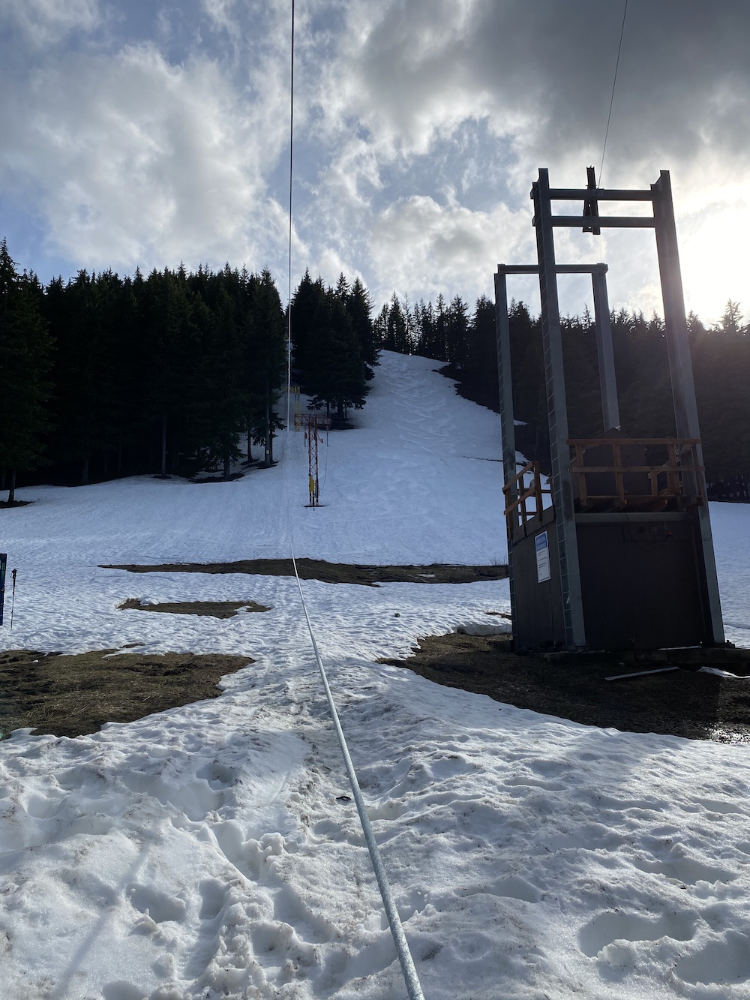
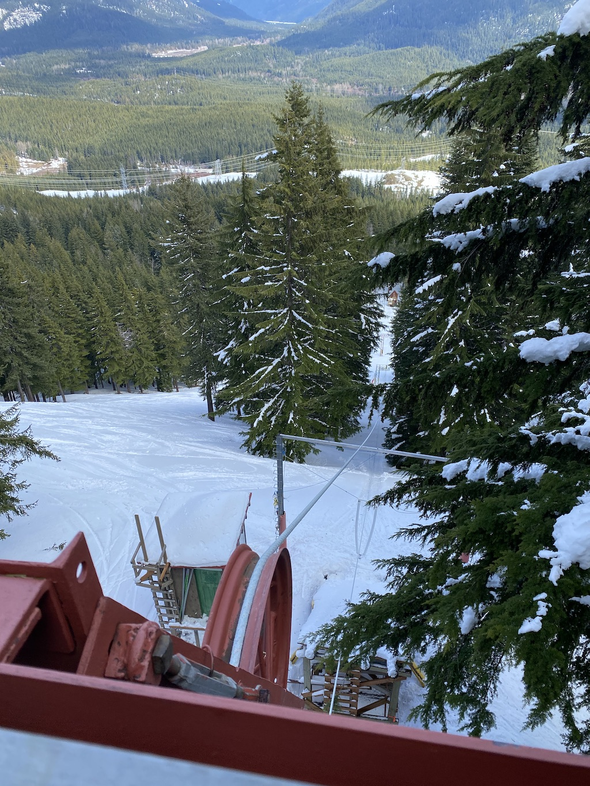
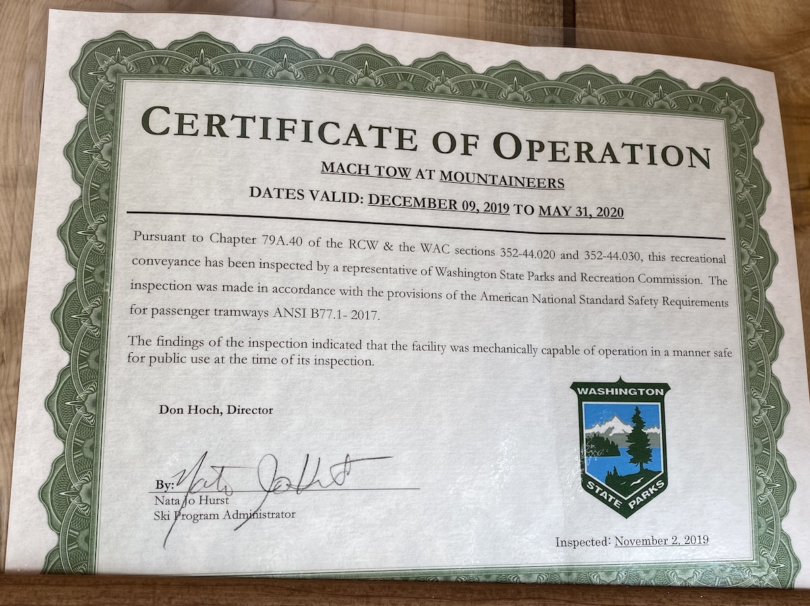

# Mach

### Names
- Mach
- Mach Tow
- Mach 2 Tow

### Description

Mach is the largest tow rope at Meany and it pulls skiers up [Kirkland Park](/Run/Kirkland-Park) and the [Lane](/Run/Lane).

### Location

Along the south edge of the [Lane](/Run/Lane).

### Origin

Mach used to have a 4-speed transmission. Typically only the first three gears were ever used, as 3rd gear was 19-21mph. Occasionally it was shifted into 4th which ran at 30mph. When propelled at such speeds it seemed as if one was approaching the speed of sound–hence the name "Mach Tow." [nw][] [75th][]

### Specifications

- Vertical: 441' ([base 2911'](2020-Mach-base-GPS.png), [top: 3330'](2020-Mach-top-GPS.png))
- Horizontal: 1,000'
- Speed: 16mph (limited by state regulations)
- Constructed: 1938
- Motor: 50 HP electric
    - prior to 2013: 59 HP Chevy 292 gasoline

### Known For

* The oldest rope tow in Washington.
* v1: built by [Jack Hossack](/Person/Jack-Hossack)[ma68][]
* v2: designed and built by [Walter Little](/Person/Walter-Little) [dc87][]
* Used to be rip-your-arms-off fast.

---
### History
#### 1937

A ski lift is to be realized before the coming season opens. [ma37][]

#### 1938

Summer 1938 was work on the ski lift and the 15x20' log cabin necessary to house the tractor. The [Lane](/Run/Lane) was widened by additional clearing and the logs used to construct the tow hut. The lift is 835' feet long and rises 310 feet in less than two minutes. It reaches 65% of the way up the Lane and is powered by the [Beast](/Machine/Beast).

The Beast was propped up clear of the floor and had maple driving rims bolted on to the large rear wheels. [ma38][ma38], [ma78][]

#### 1941

The old ski tow rope lasted the season and is even now waiting to start its fourth year...a new axle was provided for the tractor which we hope will result in a trouble-free season for the coming year. [ma41][]

#### 1943

The tow tractor was given a thorough overhaul. 300 feet were added to the length, making it 1,100 feet long with a vertical lift of 300 feet. [ma43][]

Extended rope tow to top of Lane. Added safety gate. [ma78][]

Extended to new head pole at top of the "Lane". Vertical now ~340. [hw][]

#### 1945

Install headpole at the top of lane and install safety gate, vertical now 380'. [hw][]

#### 1946

Rebuilt rope tow machinery. Discarded Fordson; replaced with 235 Chevy truck engine (with splash oiling) and transmission and truck rear end. For driving wheels used wood rims originally mounted on Fordson tractor drive wheels. [ma78][]

A Boeing jig was the base and a truck rear end for reduction gear. BRRH 87b, gear ratio 6:7. [hw][]

In 1946, a used 1942 Chevrolet truck motor was substituted to drive the rope tow. [tp][]

#### 1948

A new tow rope is threaded through the shives. No more long rope-splicing sessions! [ma48][]

#### 1953

a new tow rope was spliced into place [ma53][]

#### 1956

Begin work to relocate and rebuild. [hw][]

Complete relocation, begun in 1955. Head pole moved south about 200' and 30' higher. Tow hut moved north about 250', and about 20' lower. This was done to gain more altitude, and to get upper unloading closer to [Lower Slobbovia](/Run/Lower-Slobbovia). Rise 440'. Length 1,000'. [ma78][]

#### 1957

Completed relocation of Mach Tow. New [Tow Hut](/Building/Tow-Hut) moved 150' north on ground 20' lower. Vertical now 430'. Chev. engine moved from previous tow hut. [hw][]

#### 1958

The relocated tow provided better access to lanes and eliminated the necessity of digging out the upper part of the rope. The big social event of the season was the dedication of the new tow to [Walter Little](/Person/Walter-Little). [ma58][]

#### 1960

In 1946, a used 1942 Chevrolet truck motor was substituted to drive the rope tow. It still drives the rope. It's a better motor now than when bought. It runs all the time! It has run for fourteen years! [tp][]

#### 1964

new rope installed - $400. [hw][]

#### 1965

Meany installed a new higher head pole. Vertical is still 430'. [ma66][], [hw][]

#### 1967

Replaced engine with 1964 Chev truck, 6 cyl, 230 ci. Also replaced transmission with 4 speed B1180 13GM-T-3761930 with gear ratios 7.06, 3.58, 1.71, 0.00, Reverse 6.78. [hw][]

#### 1968

installation of a new tow motor, safety gate system, new head pole, commercial power, and re-landscaping of the two lanes and landing area at the bottom of the tow. [ma68][]

#### 1970

Install new poly dacron two rope (Plymouth I) on Feb 7, 1970. Proved defective. Plymouth replaced in March 1970, no charge. Plymouth II rope proved defective in 1971. File suit and settled for $320. [hw][]

#### 1971

Installed new rope. American mfg Co. SS-R-200 poly dacron. [hw][]

#### 1973

- added air actuated brake on idler pulley in main drive to ensure stoppage of tow rope when safety gate opened.
- Replaced 19" top pulley on head pole with 34" diameter [hw][]

#### 1974

Erect quarter pole halfway between tow hut and midway with halyards and hooks to raise tow ropes high above snow during unused periods. [hw][]

#### 197?

#### 1975

Overhaul engine, new camshaft, ground valves. New counter weight located in [Tow Hut](/Building/Tow-Hut). [hw][]

#### 1976

- Replace 4 speed truck transmission [hw][]
- Replace all halyards
- Improve safety gate at top

#### 1977

- New air compressor for operations of pneumatic brake on idler in main drive [hw][]
- Add shut-offs for cooling fluid overheat and "low engine oil pressure"
- Add new outside stop switch at bottom loading area

#### 1979

- Install 2 underground 500 gallon gas tanks to replace barrel storage; pump and plumbing [hw][]
- New motor on compressor for air brake.
- New rings and grind valves in tow engine

#### 1980

- Install new rope. Last one installed March 1971, ~ 9½ years use. [hw][]
- old rope still usable on [Worm](/Worm)

#### 1981

New mounting for lower pulley at [Tow Hut](/Building/Tow-Hut) to control rope twist. [hw][]

#### 1982

Some of the poles for were replaced. [ma82][]

- Realigned 4" X 4" steel track on front of tow hut [hw][]
- Added 7' X 8' lean-to on North corner of tow hut for gas station and line hardware
- Construct wheelways in basement of [Tow Hut](/Building/Tow-Hut) for winter storage of [Ox](/Machine/Ox)

####

- tow engine rebuilt [hr][]

#### 1986

Construct control tower (tow operators sit and watch) as required by insurance policy and lift safety codes [hw][]

#### 2003

Present engine: 1960 6 cyl. 292 hp. Chevy. Total length of rope is 2500 feet. Length of uphill trip is about 1000 feet with about 420 feet elevation gain. Presently used top speed is 16 mph, as allowed by state authority. Previously the top speed was 19+ mph, but it could and occasionally was shifted to 30 mph. When propelled up the hill at such speeds it seems as if one was approaching the speed of sound–hence the name "Mach Tow."[75th][]

#### 2013

"Mach is the oldest rope tow in the state, just as Meany Lodge is the state’s oldest ski area. But fire code is forcing a new chapter in Meany history. Because the tow house doesn’t meet code, the engine will be replaced by a modern electric motor after this season. The Chevy engine will be saved as a backup for Tom-Cat.[yore][]

##### Email from Mike Lonergan to Matt Simerson, May 5, 2020.

The electric motor on the big tow was installed during the summer and fall of 2013.  Matching the speeds to the old transmission speeds was just a few simple ratio calculations as we knew the gear ratios on the transmission and differential and the governed speed of the gasoline engine.  The old speeds worked well, so we did not change them.  The change was driven by the tow inspector who never liked internal combustion engines and finally decided we had to meet current NFPA requirements even though the ANSI code did not bury grandfather on this issue.  We felt it better to do the change rather than butt heads with the state.  It is almost impossible to meet the NFPA requirements with a fiber tow.

There was a fairly detailed maintenance log in the tow hut at one time as required by the ANSI code.  It had the dates of the changes made over the years.  Hopefully the records were not purged like most other historical information.

The current motor systems on the small and medium tows were installed several years earlier when tow operators were having trouble managing the rotary phase converter.

#### 2020

#### 2021

Replaced the Mach rope. Rope is <a href="https://www.samsonrope.com/product/ssr-1200-3">Samson SSR-1200-3</a> 1". It's a Polyolefin - Polyester Blend, 3 strand class I rope with 1.2 Specific Gravity and average strength of 25,400 pounds. 

[75th]: /Event/Anniversary#75th
[dc87]: /Person/Dave-Claar#1987
[hw]: /History/Walt "Meany History, by Walt Little"
[hr]:  /History/Reports
[ma37]: /Mountaineer-Annual#1937
[ma38]: /Mountaineer-Annual#1938
[ma41]: /Mountaineer-Annual#1941
[ma43]: /Mountaineer-Annual#1943
[ma48]: /Mountaineer-Annual#1948
[ma53]: /Mountaineer-Annual#1953
[ma58]: /Mountaineer-Annual#1958
[ma66]: /Mountaineer-Annual#1966
[ma68]: /Mountaineer-Annual#1968
[ma78]: /Mountaineer-Annual#1978
[ma82]: /Mountaineer-Annual#1982
[nw]: /Names-Walt "Meany Names by Walter Little, 1984"
[tp]: /Machine/Tomcat/Petition
[yore]: https://www.theolympian.com/outdoors/article25316305.html
