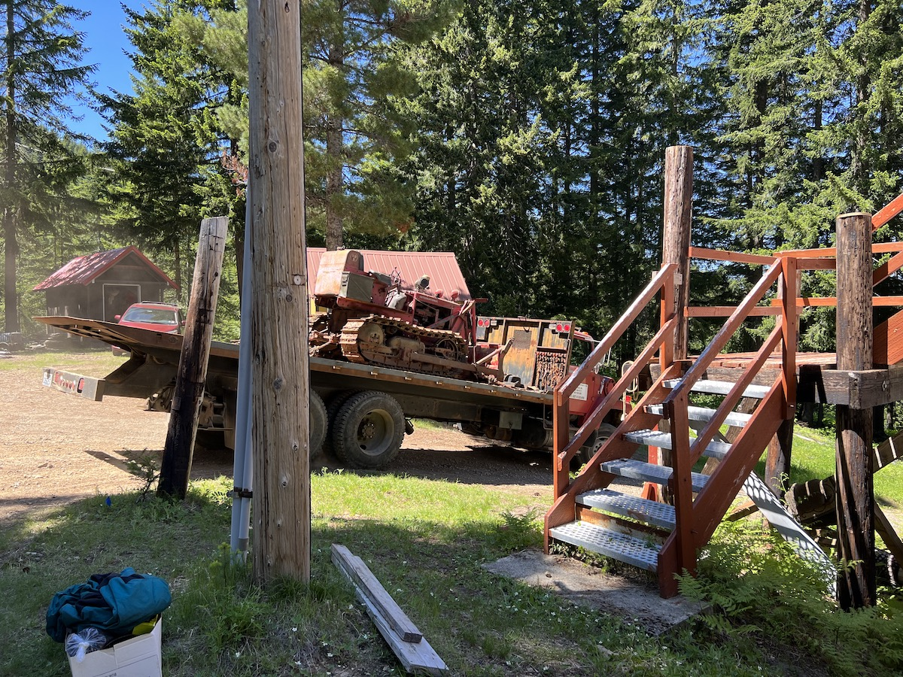
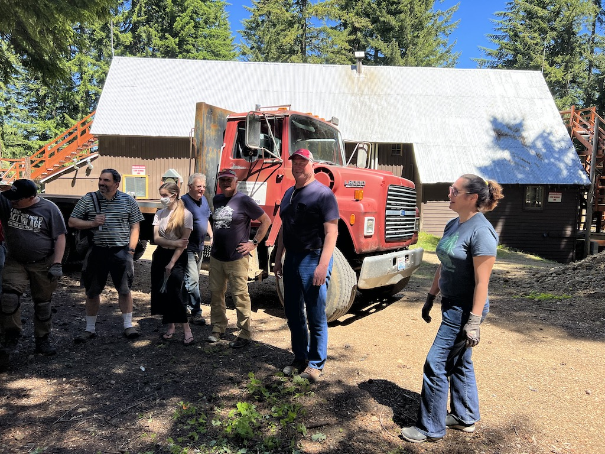
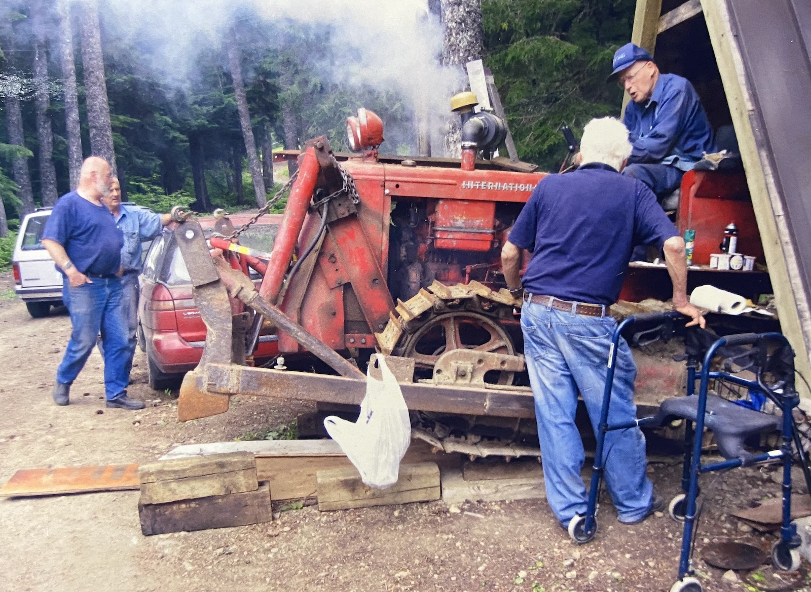

# Dozer
### Names
- Dozer
- Bob's Dozer
- [Bob Bentler](/Person/Bob-Bentler)'s bulldozer.

### Location
Under the [Dozer Tipi](/Building/Dozer-Tipi) in the [Industrial Park](/Area/Industrial-Park).

### Purpose
- smooth out ski terrain
- grade the roads

---
### History

#### 2022

The dozer was hauled away on 2022-06-26, by Tim Adamson, a fan of IH tractors.
It's fate is to be cleaned up and shown at "old engine shows." Failing that, it will
become "yard art" at Tim's place of business in Aberdeen. [ms][]

> It was great meeting everyone at Meany.
> I am grateful that y'all thought of me to take this tractor.
> I think it's going to clean up and be taken to a couple tractor shows this summer.
> I would like to compile a little history folder to put with it at the shows.
>
> There are no awards or prize money. It's just for the love of classic tractors. -- Tim

#### 2003

The Bulldozer is owned by Meanyite [Bob Bentler](/Person/Bob-Bentler). This International Harvester TD6-61 (Diesel) was used to smooth out ski lesson terrain, prepare ground at Tombstone Canyon for laying culvert pipes and to grade roads. [75th][]

[75th]: /Event/Anniversary#75th
[ms]: /Person/Matt-Simerson
