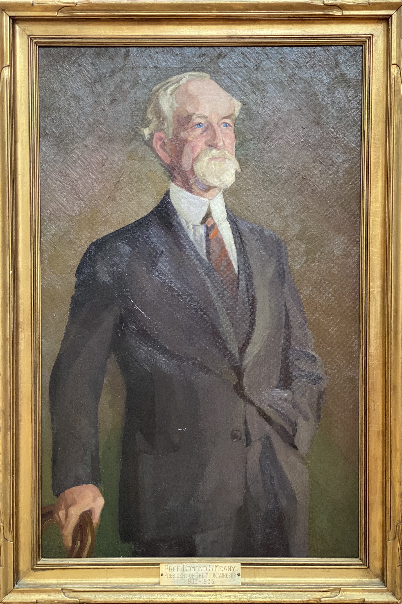

# Edmond S. Meany
### Names
- Edmond Meany
- Edmond S. Meany



## Known For
- Professor at University of Washington
- Buying the land for Meany Lodge and donating it to the Mountaineers

### See Also
- 1936 - [Creating Meany's Painting](1936-Anna-Rogers-Painting-Of-Meany.pdf)
- 1956 - [A Word Portrait of Edmond S. Meany](/Person/Edmond-Meany/Word-Portrait)
- 1998 - [A brief Biography of Professor Meany](https://www.mountaineers.org/locations-lodges/meany-lodge/history/edmond-s-meany)
- [Wikipedia Article](https://en.wikipedia.org/wiki/Edmond_S._Meany)

## Portrait

### Youth

by Annah Rogers

How the lapse of time had touched that word with magic

Now that time had brought me into full maturity,

Wistfully I thought of youth as holding in its hands

The best of life's gifts - beauty, freedom, power.

Again I was to feel the magic of its pulse

To sip vicariously at its font in college classroom.

Eagerly I looked upon its creatures as they entered

Here a pretty face, there a lithe strong body,

But the epitome of those qualities which I had attributed to youth was not there.

Then entered the Professor - silver haired, erect, with princely poise,

And in his eyes both kindliness and fire.

Poise born of mastery, kindness born of unselfed service,

And the fire born of the joy and romance of life rightly lived and battles won.

Beauty, freedom, power? - a prompting thought

Bid me look not back but forward.
