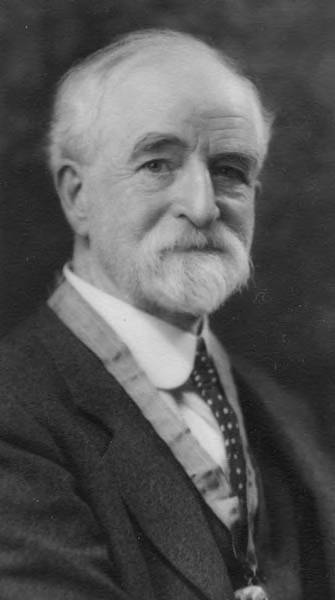

# Edmond S. Meany
### Names
- Edmond Meany
- Edmond S. Meany



## Known For
- Professor at University of Washington
- Buying the land for Meany Lodge and donating it to the Mountaineers

### See Also
- 1936 - [Creating Meany's Painting](1936-Anna-Rogers-Painting-Of-Meany.pdf)
- 1956 - [A Word Portrait of Edmond S. Meany](/Person/Edmond-Meany/Word-Portrait)
- 1998 - [A brief Biography of Professor Meany](https://www.mountaineers.org/locations-lodges/meany-lodge/history/edmond-s-meany)
- [Wikipedia Article](https://en.wikipedia.org/wiki/Edmond_S._Meany)

