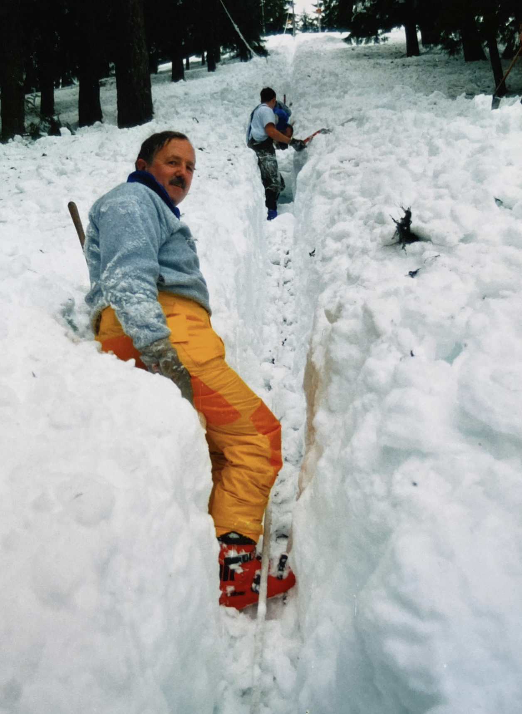

# Norm Vigus
### Events
- First year at Meany: 1958


### Known For
- Helping forge [Junior Trail](/Area/Junior-Trail)
- 1979 Bachelor of the Year Runner-up
- Caring for the rope tow pulleys
- Maker of finely carved bowls
- Mad carpentry skills

---
### History
#### 1979

Other skit characters were the minister ([Dave Claar](/Person/Dave-Claar)) and the victim (Charlie Vail). [Walter Little](/Person/Walter-Little) walked away with the Bachelor of the Year Award with Norm Vigus as runner-up. [Bob Bentler](/Person/Bob-Bentler) showed Super 8 movies of Walt and Norm to prove why they should be the winners. [ma79][]

#### 1987

Remote Meany Ski Hut boasts a bountiful winter 1987. With a very active PR Committee led by Norm Vigus.[hr][] The lodge attracted an average of 75 per weekend. [Ski School](/Ski-School) lessons kept the lodge filled on the weekends with poor snow conditions.

#### late 1990s

I signed on as an instructor in I think the late 90's.

#### 2003

'58 I guess, regular since 1960.[75th][]

#### 2020

One Sunday morning [Al](/Person/Al-Alleman) took me up to the Mt. Francis microwave towers and I skied down the clear cuts by myself coming out about 2 gullies beyond Walt's Woods. Don't know if I'd have the nerve to do that now but when you're young and invulnerable, early 40's or so. Also had memories of Al Alleman working the #2 rope at Stevens Pass in the mid/late 50's. --[Norm Vigus](/Person/Norm-Vigus)

[75th]: /Event/Anniversary#75th
[hr]: /History/Reports
[ma79]: /Mountaineer-Annual#1979
