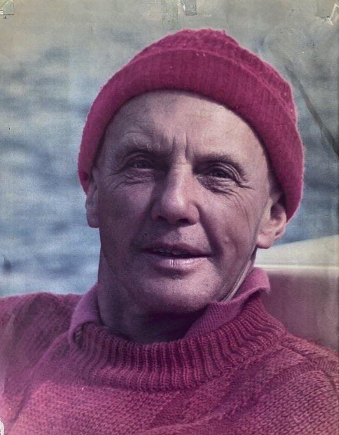

# Walter Little
### Names
- Walt Little
- Walter Burges Little

### Events
- Birth: 1909-04-29
- Meany Years: 1938-[∞](/Person//Permanent-Resident)
- Death: 2002-02-28



### Known For
- Veteran of the [10th Mountain Division](https://en.wikipedia.org/wiki/10th_Mountain_Division)
- Designed [Mach](/Mach).
- Planned the Steven's Pass lodge
- Helped design tows and lifts at Crystal & Whistler.
- Sailor
    - Life Member of Seattle Yacht Club
    - Founder of [Pacific Handicap Racing Fleet](http://phrf-nw.org/founders/)
- Fan of [Al Capp](https://en.wikipedia.org/wiki/Al_Capp) and L'il Abner.
- [1979 Meany Batchelor of the Year][ma79]
- Writing about Meany
    - 1940 [Meany Ski Hut][ma40]
    - 1941 [Mountaineering on Skis][ma41]
    - 1978 [Meany History][ma78]
    - 1984 [Meany Names](/Names-Walt)
    - 1984 [Chronological History of Meany Lodge][hw]
- [Walter's Little Spring](/Building/Propane-Hut)
- member of the Ancient Skiers
- [Permanent Resident](/Person/Permanent-Resident)
- Member of the Mountaineers Birth Control Society, ("bigger! bigger! make those ski jumps bigger!")

### See Also
- [Linda Bresee article](/Person/Linda-Bresee#Walter)
- Obituaries: [Alpenglow](http://www.alpenglow.org/ski-history/notes/orig/little-walt-obit.txt), [PHRF Obit](https://phrf-nw.org/founders/), [Dave Claar](Obit-Claar)

---
### History
#### 1943

#### 1956

#### 1958

The relocated tow at Meany provided better access to lanes and eliminated the necessity of digging out the upper part of the rope. The big social event of the season was the dedication of the new tow to Walter Little. [ma58][]

#### 1975

#### 1978

[Bob Cram](/Person/Bob-Cram) said this of Walt Little, who has skied Meany for forty of its fifty years: "Walt was a pioneer in ski technique. Anything that was crazy Walt had already tried." Besides his many technical contributions Walt concocted many of the names around [Meany Hill](/Meany-Hill) like [Psychopath](/Run/Psychopath) and [Lower Slobbovia](/Run/Lower-Slobbovia). Walt, with his keen intellect, has helped create the friendly and witty Meany atmosphere. [ma78][]

One extra special Saturday night program was the dedication banquet for [Walter's Woods](/Run/Walter's-Woods) with Master of Ceremonies [Lee Helser](/Person/Lee-Helser) cleverly spicing the evening and a film on Walter shown by [Bob Bentler](/Person/Bob-Bentler). A huge cake shaped like a bald head contained a hidden cavity which was opened to reveal Walter's thoughts in the form of sayings on heart-shaped candies. [ma78][] p.173

#### 1979

Other skit characters were the minister ([Dave Claar](/Person/Dave-Claar)) and the victim (Charlie Vail). Walter Little walked away with the Bachelor of the Year Award with [Norm Vigus](/Person/Norm-Vigus) as runner-up. Bob Bentler showed Super 8 movies of Walt and Norm to prove why they should be the winners. [ma79][]

#### 1982

It all started when the "Advanced Emissary of the New Year's Baby," Walter B. Little, appeared. [ma82][]

#### 2021

A group of 5 skiers, all of whom visited Meany regularly in the 1970s, including Dale Karr and "I'm the woman that broke one of Walt's ribs, and the reason he bought that bright yellow suit," visited and regaled us with anecdotes.

[hw]: /History/Walt "Meany History, by Walt Little"
[ma40]: /Mountaineer-Annual#1940
[ma41]: /Mountaineer-Annual#1941
[ma58]: /Mountaineer-Annual#1958
[ma78]: /Mountaineer-Annual#1978
[ma79]: /Mountaineer-Annual#1979
[ma82]: /Mountaineer-Annual#1982
