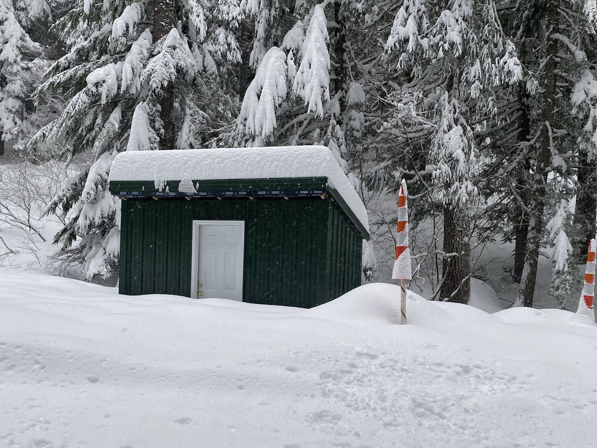
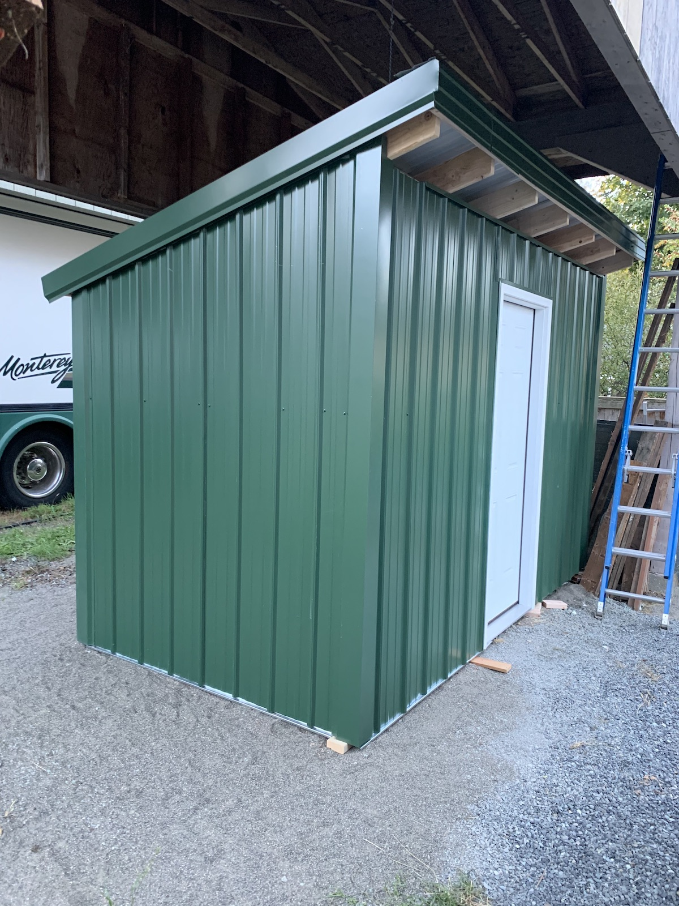

# Pump House
### Names
- Pump House
- Hoe House (ask Amy, I dare you)

### Location
South of the [Industrial Park](Industrial-Park).

### Purpose

Part of the [Water](Water) system. It encloses the well head and reservoir access. The hut make it dramatically easier to maintain the water system in the winter. It also protects it from the elements and rogue snow machines.

### More Info

Designed and built in 2019, in Shoreline, by [Matt Simerson](Matt-Simerson). It was then disassembled, hauled to Meany by [Jim Fahey](Jim-Fahey) in a box truck and reassembled by a Meany work party.

Cost: $1,689

### Roof Removal

1. Acquire a cordless drill
2. Acquire 3 helpers
3. Chuck the torx bit found in the screw box mounted to the wall inside the Pump House
4. Remove the green painted screws along the 4 top rails.
5. Lift the roof straight up ~ 4"
6. Slide the roof towards the back of the structure.
    * note: the roof assembly rests on the end rails
7. After lifting and sliding the roof back ~6 inches, set it on the side rails. Send two helpers to the rear of the structure to catch and lower it.

### See Also
- [build a Pump House](https://github.com/MeanyLodge/Committee/issues/1)