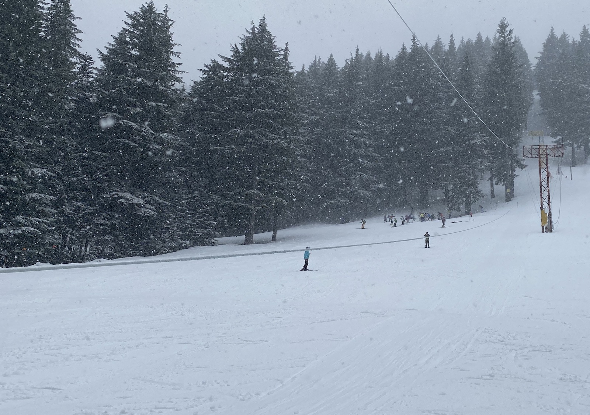

# Kirkland Park

### Location

Large open area to the southeast (skier's right) of the [Lane](/Run/Lane), immediately below [Soffreenia Wood](/Run/Soffreenia-Wood).

### Origin

See the 1938 history record.

### History

#### 1938

During construction of the rope tow in summer, 1938, the Lane was widened at its bottom end toward the southeast to make room for the rope tow and tow hut in its original location. This left some large stumps in the area. Bill Kirkland, who stood about 6'4" and weighted like 240 pounds decided that dynamite was the answer. The hut committee wouldn't buy him any, so Kirkland bought his own. His theory in loading powder under stumps was "if a little is good, more is better." Several dozen explosions later, Kirkland Park, instead of being infested with stumps was infested with craters. An indignant hut committee forcibly terminated Kirkland's operations after one of his stumps sailed 300' through the air and narrowly missed taking the roof off the newly built tow hut. Kirkland's stump holes have all be eliminated by bulldozing, but the name remains. [nw][]

#### 1941

Work parties this fall have widened and smoothed _Kirkland Park_ until good skiing is now guaranteed with one foot of snow. [ma41][]

#### 1948

The novice lane to the left of the tow begun last year has been lengthened and widened. [ma48][]

[bk]: /Person/Bill-Kirkland
[nw]: /Names-Walt "Meany Names by Walter Little, 1984"
[ma41]: /Mountaineer-Annual#1941
[ma48]: /Mountaineer-Annual#1948
[map]: /Meany-Map
