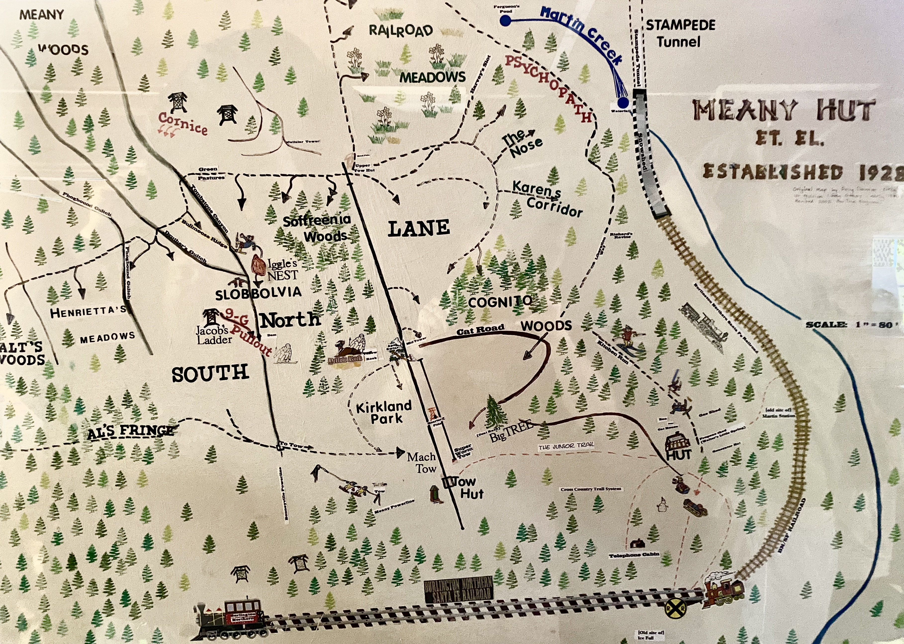

# Ski Runs

See [Meany Hill](Meany-Hill) for a geographically ordered tour of the ski runs and areas on Meany Hill.

* [Cat Track](Cat-Track)
* [Cognito Wood](Cognito-Wood)
* [Damnation](Damnation)
* [Harvey's Slot](Harvey's-Slot)
* [Henrietta's Woods](Henrietta's-Woods)
* [Kirkland Park](Kirkland-Park)
* [Kitchen Run](Kitchen-Run)
* [Lane](Lane)
* [Lefty](Lefty)
* [Liberation Way](Liberation-Way)
* [Lower Slobbovia](Lower-Slobbovia)
* [North Slobbovia](North-Slobbovia)
* [Nose](Nose)
* [Psychopath](Psychopath)
* [Railroad Meadows](Railroad-Meadows)
* [Side Track](Side-Track)
* [Soffreenia Wood](Soffreenia-Wood)
* [South Slobbovia](South-Slobbovia)
* [Walter's Woods](Walter's-Woods)
* Defunct:
    * [Downhill Trail](Downhill-Trail)
    * [Elevator Shaft](Elevator-Shaft)
    * [Helser's Ess](Helser's-Ess)
    * [Kitchen Jump](Kitchen-Jump)

### X-Country Runs

* [Al's Fringe](Al's-Fringe)
* [Nikki's Trail](Nikki's-Trail)
