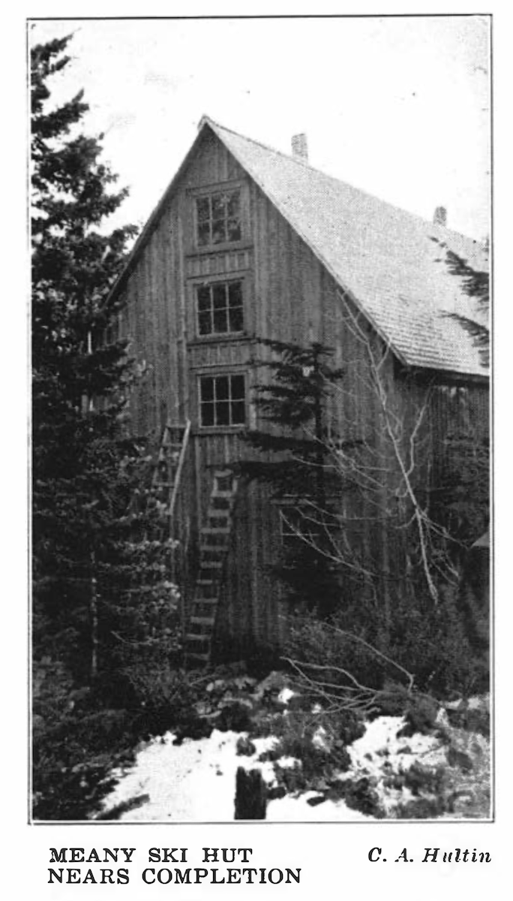

# Skiing and the Ski Hut
by Mrs. Stuart P. Walsh

_[The Mountaineer Annual 1928](https://www.mountaineers.org/about/history/the-mountaineer-annuals/indexes-annuals-maps/the-mountaineer-1928)_

p. 45

GRAY, snow-prophesying clouds overhead, white-tipped, undulating hills for a background, the Club and national colors waving joyously from the freshly hewn flagpole, a hundred people grouped about, happily aware that the new ski hut was an accomplished fact, Doctor Meany towering like one of the pine trees nearby, expressing for these other Mountaineers the ideals of all outdoor lovers-such was the dedication of the Meany Ski Hut on Armistice Day, 1928.

Twice before have Mountaineer shelters been dedicated, one as a base for forest exploration, one for climbing peaks. This third is unique in that it is to be devoted to the sport of skiing and its existence but eight years after the first ski trophy was offered is nothing short of remarkable.

Its presence indicates further the leadership The Mountaineers have assumed in promoting this virile sport in the Puget Sound country. This is no more than fitting; traditionally The Mountaineers have been pioneers. First, by opening up mountain climbing exploration as a sport, they paved the way to enlarged enjoyment of similar activities by the public. Second, in penetrating Paradise Park in winter and year by year proving the practicability of such an outing, they created the groundwork for the later opening up of the Park to winter tourists. Now, rightfully, our organization assumes and recognizes its leadership in a third field, skiing. How greatly our promotion of it will affect skiing in general can only be estimated by the scope of the Club's influence already proven in other Mountaineer fields.

Eight years ago the building of a shelter cabin for ski enthusiasts was unthinkable. So unknown was the sport in the Northwest that the few men and women indulging in it were regarded as veritable superhumans by their sure but clumsy-footed brethren. To none but

p. 46

the most poised and daring did it occur that they, too, might master the art. It was therefore a happy shock to Club members in general when in 1921 the then devotees offered two cups, one to women skiers, one to novices, men or women.

These trophies suggested the surprising idea that ordinary humans-even you and I-might not only succeed in standing upright on the treacherous footwear, but in addition might exhibit sufficient prowess to win a tournament, to possess a ski cup!

A revolutionary bomb! Almost immediately enthusiasm kindled, the meager stock of skis in Seattle shops fell short, and ski-mindedness became normal to Mountaineer psychology. Year by year the ratio of skis to snowshoes shifted until the season 1927 found snowshoes almost as rare as were skis a few years back.

With the popularity of the ski came a larger fulfillment of the object for which The Mountaineers was founded: "to explore and study the mountains, forests and water courses of the Northwest ... to encourage a spirit of good fellowship among all lovers of outdoor life." In the "good old days" little indeed were the winter mysteries of mountain, forest, water course pierced by enterprising Mountaineers; the maximum distance via snowshoe forbade it. From the Lodge, on the one (sometimes two) outings scheduled for the Club per month, trips to Lookout Point or to the lakes or the Summit were the sufficiently exhausting bill of fare. Between Club outings, small, exclusive private parties absorbed the hospitality of the big stone fireplace at the Lodge. In addition, there was, of course, the unsurpassable New Year's trip to Paradise. But compared with the season 1927-1928, winter alpine activities were rather slim.

Behold now the year just ended: the Lodge full to capacity nearly every weekend from December to April; special, well-patronized outings to Stampede Pass; private trips to Mount Rainier, in addition to the regular New Year's outing; cross country ski trips and climbs worthy of record; not to mention the fact that novices after several weekends on burn and Lodge rockslide managed the trip to the lakes, former high goal of tortoise snowshoers.

A long list of creditable achievements these by ski artists! A party of six encircled Mount Kathryn, going via Surveyor's to Rockdale Lake, to Mystery Lake and back via Oolalee Meadows. Two men skied the Big Loop from Stampede to Martin, a total of fourteen or fifteen miles. Another group went to Mirror Lake. A party of four cross countried from Denny Creek to Melakwa lakes over the divide to Melakwa Pass, to Snow Lake and back to the Lodge, and reported this to be the finest trip in the Lodge country.

Silver Peak was twice conquered and the cirque below its summit frequently visited. Three men traipsed from the Lodge to Keechelus

p. 47

via Oolalee Meadows, Twin Lakes, Gold Creek and Keechelus. Six took the trip from the Lodge to Stampede via Stirrup Lake (this trek necessitated an overnight bivouac in the snow near the lake, but with a blazed trail put in over this route, it should be a successful one-day trip for athletic ski artists).

Perhaps the most noteworthy climb on skis was the attempt at the north side of Mount Rainier via Camp Curtis made in April, 1928, by seven Mountaineers. Skis were used up to 12,000 feet, after which ice conditions compelled their abandonment in favor of crampons. Three men reach the summit successfully. Although skis were not of service for the whole ascent, their use up to the 12,000-foot level made the trip practicable at so early a season.

It is evident, then, that the sport of skiing is responsible for a greatly increased enjoyment and exploration of our mountains in winter time. That it has fostered a "spirit of good fellowship among all outdoor lovers" is quite as apparent to anyone who has watched the gay camaraderie of a hillside of skidding, tumbling, flying Mountaineers as merry as their costumes! Not only has our own organization benefited but the joys of winter alpine activities have been introduced through Mountaineer leadership to many other groups, to young people in school clubs, to Camp Fire Girls, Boy Scouts and others.

So greatly has the enthusiasm for skiing grown that in 1927 plans began to formulate for a second club base to care for the overflow from Snoqualmie Lodge, perhaps the forerunner of several shelter huts scattered at a day's trek from one another, as in ski-wise Europe and the Appalachians. At any rate, the new site happens to be a day's journey from the Lodge. The location at Martin on the east and colder side of Stampede Pass guarantees a month longer skiing sea-

p. 48

son than at Snoqualmie, and it has many other advantages. It is as adjacent to Tacoma as to Seattle, and the convenient N. P. schedules make it at least as accessible to Everett as is Snoqualmie. It is an easy five minutes' walk from the railroad. The transportation cost is little more than for the Lodge and less than for Rainier. It resembles Paradise in that it has long, unbroken hillsides where novice can gain confidence and artist mile-long runs and everyone find the slope of his choice.

Scenically, the location at Martin is pleasing. The Hut nestles in a little grove of young evergreens, pine, hemlock, fir and yew, while close by is a hill affording sweeping views into Keechelus and Kachess country. Encircling the close-by horizon are friendly, rounded, forested mountains, while from a point within easy walking distance one can see the sharp white silhouettes of the jagged peaks beyond Keechelus already gleaming in virginal snow.

A frame building, is the ski hut, comfortable, serviceable. It is primarily a shelter cabin, a sort of storage battery where weary skiers can recharge their energy and, renewed, go forth to further adventures. One enters the front door and discovers a long, well lighted, spacious room with easy staircases running up either end leading to dormitory quarters on the second story. An open kitchen at the far side sends out intriguing whiffs of bounteous feasts under way. Tables and benches sprawl about the room and canvas-back easy chairs invite one to sit for a bit near the round-bellied heating stove. There is no fireplace to lure one away from the outdoors. There is, instead, creature comfort-warmth, rest, shelter, always subservient to the major interest-the white, swift slopes outside.

The lofty dormitories are equipped with fifty-two spring double decker bunks and new mattresses. There are sinks with hot running water, mirrors aplenty and hooks to one's heart's content.

A good beginning, the Meany Ski Hut of Armstice Day! A promise of widened interest in skiing for the whole Northwest!
