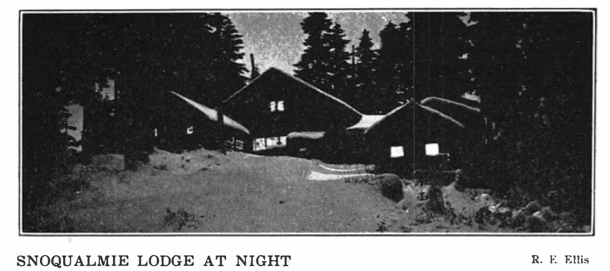

# Snoqualmie Lodge

## [1944][ma44]

p. 37

The Mountaineers suffered a great loss this year in the destruction by fire of Snoqualmie Lodge. Over 20,000 names have been registered since its completion in 1914; each have contributed to its background of tradi­tion. Vince Millspaugh and his committee had done a great deal of work to make the lodge an even more desirable place, and this season proved to be a particularly popular one. We look forward with anticipation to the time when this spirit is carried over into the planning and building of a new lodge.

p. 40

### Snoqualmie Lodge: 1914 - 1944

It was reached by train to Rockdale followed by a two-mile trail trip. But those hardy old-timers came up oftener and in greater numbers than later when use of the highway cut the trail trip in half.

Nov. 9, 1913, one hundred eleven were in a party that went up to look over the proposed lodge site. The plans were drawn by Carl Gould (mem­ber) and work started May 8, 1914.

Dedication day was June 21, 1914, and found the log walls up and roof partly done. The ceremonies were held with Professor Meany, Pro­fessor Turner, Mr. A. H. Denman, and May Ingraham speaking. After­wards everyone made up a work party and carried up shakes for the roof. Individuals and work parties labored during the summer until the Lodge was ready for occupancy by August. Between June 21, 1914 and Oct. 17, 1915 eight hundred signatures were put on the register. The bricks for the stove chimneys went up from Rockdale in Mountaineers' rucksacks. The Forestry Service cooperated, as usual, in every way.

## [1946][ma46]

### Report from Snoqualmie Lodge Site

Considerable progress has been made in the building program this last summer. Starting with virgin forest the following improvements have been made:

- A good trail from the road to the building site has been constructed.
- The water tank and a considerable amount of 2-inch pipe have been moved from the old Snoqualmie Lodge site.
- The water system has been laid out. A dam has been constructed and several hundred feet of pipeline dug.
- The right-of-way for the electric wires from the highway to the site has been cleared.
- A contract has been made with a logging company that will give us a good
road, a bulldozed building site, a ski hill cleared with the stumps cut close to the ground, and $1250 cash. This clearing will enable the club to construct a ski lift for operation during the winter season of 1947-48 if materials can be obtained.

A combination rest room and tool house has been constructed. Considering the difficulties we have made good progress this year, and hope to be able to do better next year. Unless material shortages or government regulations prevent us, we expect to build the basic Lodge building next summer.

All club members who can, should plan to give some of their time for work parties. This new lodge should fill the present need for more skiing facilities as well as give us a good climbing and week-end vacation spot. We'll be seeing you on next summers work parties.

## [1956][ma56]

p. 18

Then in 1944 disaster struck: the lodge burned to the ground, despite the efforts of C. L. Anderson, the only person present, who suffered severe injuries and burns in his attempts to stop the blaze. Today the forlorn remains of the fireplace still stand, in mute testimony to the many wonderful times enjoyed by Mountaineers in what is truly one of the beauty spots of the Cascades.

## 1960

Starvation of a Lodge organism by an inadequate supply is not a new experience for the Mountaineers. In 1937 Walt Little chairmanned a fact-finding committee, which inquired into the difficulties besetting the original Snoqualmie Lodge, which burned in 1944. All supplies and customers had to come up a trail a mile long, 750-foot rise. Symptoms of starvation were clear. People were unwilling to serve on committee; so a caretaker had been hired; not enough people came to pay enough fees, so the operation was deeply in the red; not enough workers would show in the summer to cut wood, so a woodcutter was hired. The caretaker was subsequently discontinued, and the Lodge operated on a very limited basis until 1944 when it burned, losing money but not as much. [tp][]

## [1967][ma67]

p. 79

Andy Anderson who had inadvertently started the fire that burned down the old Snoqualmie Lodge, wanted to do something for the club so he took Dave Castor down to Mt. Hood to see the new ski lodges in that area. Many of the ideas such as a gas cooking stove in the kitchen, trusses to hold up the main floor ceiling, so as to eliminate need for posts, and others, were obtained from the trip.

[ma44]: https://www.mountaineers.org/about/history/the-mountaineer-annuals/indexes-annuals-maps/the-mountaineer-1944
[ma46]: https://www.mountaineers.org/about/history/the-mountaineer-annuals/indexes-annuals-maps/the-mountaineer-1946
[ma56]: https://www.mountaineers.org/about/history/the-mountaineer-annuals/indexes-annuals-maps/the-mountaineer-1956
[ma67]: https://www.mountaineers.org/about/history/the-mountaineer-annuals/indexes-annuals-maps/the-mountaineer-1967
[tp]: Tomcat-Petition
