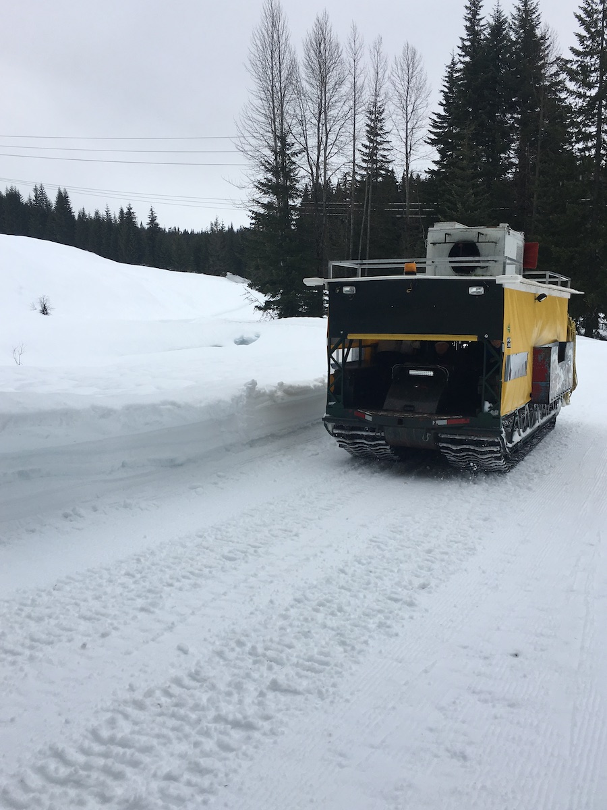
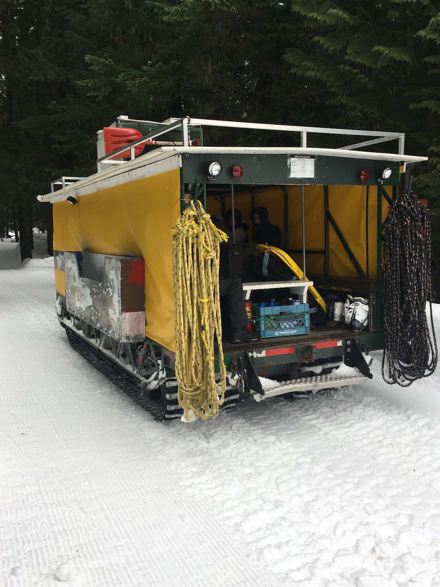

# Tomcat
### Names
- Snow Tractor [ma60][]
- Snow Cat [tp][]
- Snocat
- Cat
- Tom Cat [77](#1977)
- Tomcat

### Purpose

Haul people, gear, and supplies ~3 miles back and forth from the Crystal Springs Sno-Park to Meany. Bought in 1960 after the NPRR discontinued passenger train service to Martin.

### Specifications
- Model: 1956 Bombardier Muskeg
- Engine: Chevrolet 292ci 6-cylinder, 147 HP
- Fuel: gasoline
- Capacity: ~100 persons (think: very long tow rope)
- Acquired: 1961
- Cost: $4,800

### Mechanics

Tomcat requires a lot of care, therefore it has many mechanics. If a [Mechanic](Mechanic) at Meany works on any machine, they also work on Tomcat. We also have a long standing tradition that in order to [drive](Driver) Tomcat, you have to wrench on Tomcat.

---
### History
#### 1960

In April 1960, the Northern Pacific Railroad removed its trains No. 5 and No. 6, making Meany Ski Lodge accessible only over three miles of snow. The Meany Committee was authorized to negotiate a lease for the use of a snow tractor during the 1960-61 ski season. [ma60][], [tp][]

April: NPRR discontinued local passenger train service. After 31 years of access by train, Meany must now find another way. Will Meany Survive? October: Rental agreement with Symington for use of Bombardier Sno Tractor to haul skiers from Snoqualmie Pass Highway across valley to Meany-3 miles. [ma78][]

#### 1961

In 2.5 months operation, the tractor has hauled more then 800 skiers. On one Sunday last month after skiing, the tractor hauled 86 skiers from the lodge to the road. Twenty rode the tractor, the other 66 strung out along ropes lengthened to 230 feet for the trip. [htt][]

#### 1962

Snow Tractor operation proved so successful during the first months of use that the Board of Trustees approved the purchase. A new cabin was built on it. [ma62][]

#### 1963

The "longest rope tow in the Northwest"-The Snow-Cat to Meany Ski Hut-was the life-line which kept the hut as popular as ever during the 1962 ski season, having on occasion, upwards to 85 persons. [ma63][]

#### 1964

New tracks - $1400. New type grousers, endless belts composite of steel, cotton fabric and rubber. Original tracks used 1961-64, 4 seasons. In 1964 much belt breakage and patching. [hw][]

#### 1965

Meany's snow-cat just made it through the winter before the tracks wore out; the Board of Trustees voted funds to buy a new set for the coming season. [ma65][]

#### 1966

overhauled the snocat[ma66][]

#### 1967

engine was completely rebuilt and is expected to last several years[ma67][]

#### 1968

Suddenly an apparition appears around the corner. An immense flat-roofed version of Snoopy's "Sopwith Camel" (doghouse version), gaily painted with alpine flowers and fantastic creatures moves into view. Could that be Snoopy himself in the cockpit in his World War I flying helmet chasing the Red Baron? On closer scrutiny it turns out to be our driver, [Tom Van DeVanter](Tom-Van-DeVanter). He roars on by as two long ropes are unhooked from the tractor and thrown out onto the road behind. Beginning skiers climb aboard the tractor while the old pros shoulder their packs and take a loop in one of the two ropes. 9:30AM has arrived, and the driver is champing at his microphone to get going. Tail-end Charley radios all clear to start, and with a roar we take off down the road, scattering teenagers into the snow banks like scared chickens. [ma68][]

Somebody halfway up the rope has a loose safety binding, loses his ski, and goes down! This should really make a walloping pig-pile, but no, the tractor has stopped-oh, the wonders of CB Radio. Now we see why Snoopy wears that WWI flyers helmet-it's got earphones. It's every man for himself crossing the Milwaukee tracks while the tractor waits on the other side; then off again, a long double line of brightly colored parkas and packs from which come random puffs of condensed breath. Now and then a snowball is scooped up to land upon an unsuspecting victim.

Soon we cross the bridge, up the slope to a peculiar little structure below the N.P. tracks full of "gas" drums, and affectionately called [Edifice Wreck](Edifice-Wreck), the end of the line. The driver calls "All out, and don't forget to take up a box of food!" A long nomad migration slowly starts the perilous ascent to the tracks up the "N.P. Icefall." An unfortunate newcomer is seen with two suitcases, a 17-1/2 pound loosely rolled sleeping bag and poles and skis sticking out in all directions from under his arms. He soon learns that a pack is a necessity at Meany and flounders off to the side in knee-deep powder to let the others by.

#### 1969

Tracks installed in 1964 lasted 4 seasons but in 1969 much breakage and patching. New design belts made by Meany made of conveyor rubber belting: Bastron Std. 315 Dacron 3 ply synthetic rubber. [hw][]

#### 1971

Taken to Seattle for rebuild. Install rebuilt Chev 6, 292ci, convert to 12v system, install chev 3 step hydromatic transmission, vertical radiator, and new engine box.

Later 3 crankshafts successively failed because of destruction of thrust bearing. Finally determined that automatic transmission was developing end thrust on engine. Engine bearings not designed for this and failed. Reinstalled old Chrysler 252 engine and stick shift transmission for 1971 season. [hw][]

#### 1972

- Install rebuilt chev 6 cyl 292ci engine and 4 speed truck manual transmission[hw][]
- Replaced ring gear and bearings in steering differential

#### 1973

overhauled running gear, tires and bearings. New tires on rear wheels. [hw][]

#### 1975

new roof, new driving axles, new muffler [hw][]

#### 1976

Installed bearings on exterior ends of driving sprocket axles to save wear on spline on interior ends. [hw][]

Connecting rod broke thru block on Bombardier sno cat on Sunday evening trip out to road. What a day-Sleet crust 3/4" thick; rain; late start. Finally got everybody to road and started home by 8:30 pm. Motor replaced in 3 days!!! [ma78][]

#### 1977

- this machine, previously listed as "snow tractor" renamed to distinguish it from [Pack Rat](Pack-Rat) snow tractor. [hw][]
- Add over speed governor
- Construct 14' X 17' concrete slab to facilitate maintenance

#### 1978

Maintaining the equipment has taken an enormous number of volunteer hours. The Bombardier Sno Tractor used to haul skiers from Stampede Overpass to Meany since the trains stopped service in 1960 has needed careful attention as it is Meany's lifeline. [ma78][]

#### 1980

New tracks were put on the Bombardier. [ma80][]

- Replaced rubber track belts, some grousers[hw][]
- Old belts installed in 1969, 11 years
- Material is Goodyear Plylon 3150 synthetic rubber. 3 nylon plies. Rated strength is 315# per inch of width

#### 1982

- Overhaul engine, replace track bolts, Repair running gear, particularly front bogies. [hw][]

Tom-Cat was refurbished with new paint, new canvas, new upholstery, and gorgeous Scandinavian designs on the ski boxes. In addition to "flowering" the ski boxes, Georgean Curran "rosemaled" the picture boards for Meany walls. [hr][]

#### 1998

The frame was lengthened by about five feet by [Mike Lonergan](Mike-Lonergan). [75th][]

#### 2003

Once there is snow on the ground the Bombardier snow tractor is used to haul everything, including skiers, the three miles from the parking lot up to the lodge. The cat was bought in 1960, when NPRR stopped its passenger train service to Meany. Legendary meanyite [Tom Van DeVanter](Tom-Van-DeVanter) has piloted hte cat from 1960 to 2002 (hence the name "Tomcat"). Tomcat is the most important support animal at Meany. The stories Tom and it have generated over the decards are too numerous to explore here, but compiled in a book they would make very colorful reading of man and machine and volunteers in the backcountry. Snow tractors have notoriously high maintenance requirements, and due to age and heavy use Tomcat is almost always in need of care. Original engine: Chrysler 252, flat head. New engine: Chevyrolet 292, six cylinder, installed in 1971. New transmission: Chevyrolet, installed in 1971. New belts: Meany manufactured, rock conveyor-Dacron, 1969. The frame was lengthened by about five feet in 1998 by Mike Lonergan. Total carrying capacity is about 100 people and their gear towed by ropes and in machine. [75th][]

#### 2013

When it arrives, two long ropes are tossed off the back of the covered tractor with tank-like tracks. Skiers grab hold and are towed down a popular snowmobile road before veering left onto a less-used route. Here, the tractor might pick up speed, slowing only to cross the railroad tracks that once delivered skiers from Seattle. [oly][oly]

#### 2020

In January, at a special mid-week work party, the following persons trekked up to Meany Lodge to put new tracks on Tomcat: [Chuck Welter](Chuck-Welter), [Matt Simerson](Matt-Simerson), [Dan Nord](Dan-Nord), [James Kotlik](James-Kotlik), [Norm Vigus](Norm-Vigus), [Michael Froebe](Michael-Froebe), [Rick Ingham](Rick-Ingham)

In May, [Alex de Klerk](Alex-de-Klerk) shipped the old differential to Minnesota Outdoors to get rebuilt.

[75th]: Anniversary#75th
[htt]: Skiers-Hit-The-Trail
[tp]: Tomcat-Petition "Petition to Get a Snow Cat"
[hr]: History-Reports "Meany History Reports, by Idona Kellogg"
[hw]: History-Walt "Meany History, by Walt Little"
[ma60]: Mountaineer-Annual#1960
[ma62]: Mountaineer-Annual#1962
[ma63]: Mountaineer-Annual#1963
[ma65]: Mountaineer-Annual#1965
[ma66]: Mountaineer-Annual#1966
[ma67]: Mountaineer-Annual#1967
[ma68]: Mountaineer-Annual#1968
[ma78]: Mountaineer-Annual#1978
[ma80]: Mountaineer-Annual#1980
[oly]: https://www.theolympian.com/outdoors/article25316305.html
