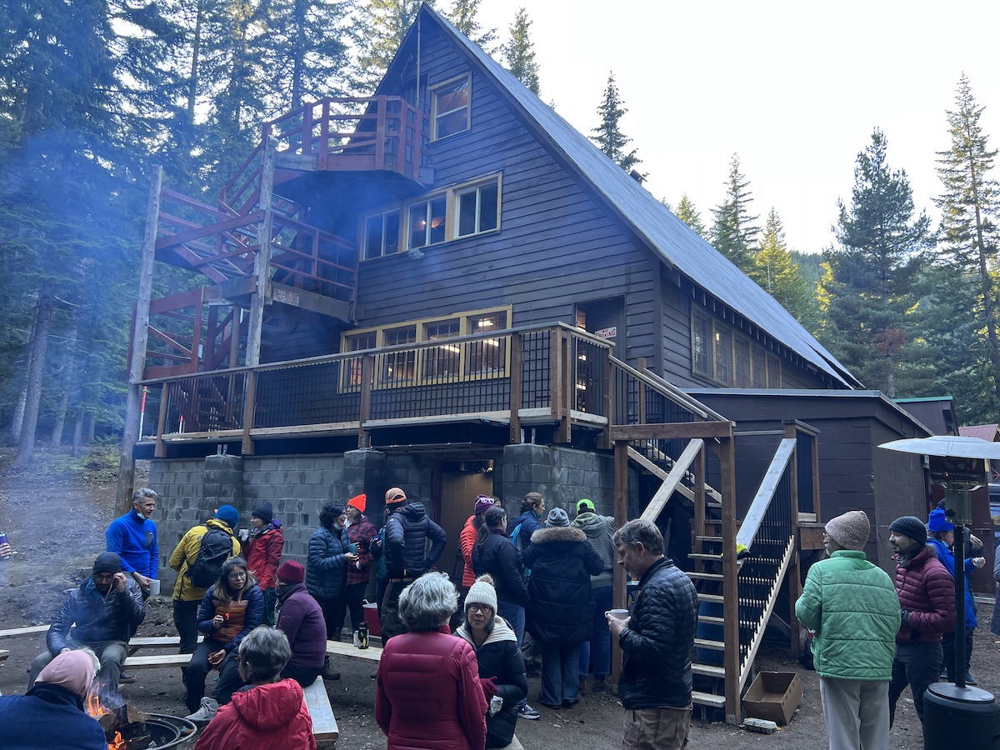

# Tunnel

### History

#### 2022

Significant repairs. Footings rebuilt to modern standards, wooden walls replaced with concrete blocks, covered with aluminum decking. See [#12](https://github.com/MeanyLodge/Committee/issues/12)

#### 2008

[Dave](Dave-Claar) put in new foundation for tunnel (under the front porch) east wall
[hi][]

#### 1985

Construct new structure on East end, combining fire escape, front entrance, basement entrance, and ski room. Replaces inadequate front porch. [hw][]

[hw]: History-Walt "Meany History, by Walt Little"
[hi]: History-Idona#1985 "Chronological History of Meany Lodge"
