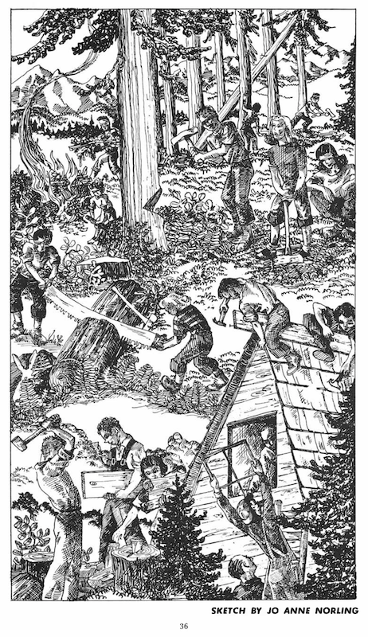

# Work Parties

Meany is an all-volunteer lodge. Everything at Meany is the result of hundreds of thousands of hours donated by hundreds of individuals. This page gets periodically refreshed from the [committee wiki](https://github.com/MeanyLodge/Committee/wiki), where more current information is maintained.

## 2020

- overhauled the fire alarm wiring.
- Cleaned the dam pre-filter and the reservoir
- [Annual Maintenance](https://github.com/MeanyLodge/Committee/wiki/2020-Annual-Maintenance)
- [2020 Project List](https://github.com/MeanyLodge/Committee/wiki/2020-Projects)
- [Coronavirus work party safety ideas](https://github.com/MeanyLodge/Committee/wiki/Coronavirus-Work-Party-Safety-Ideas)

## 2019

Woodshed: replaced the roof. Replaced plywood decking with 2 layers of 3/4 plywood and covered with a fully adhered PVC membrane. Tearoff and framing team led by [Matt Simerson](Matt-Simerson) and membrane installation led by [Steve Bozorth](Steve-Bozorth).

Water pipe run from the new well to the lodge and electrical power from the Zoo. Matt Simerson built a [Pump House](Pump-House) to cover the newly installed well.

LEDs everywhere! [Michael Moreland](Michael-Moreland) led replacing all LED fixtures on the main floor. [Matt Simerson](Matt-Simerson) led rewiring every other 4' fixture (basement, Zoo, Cat House, Tow Hut) for use with single-ended LED bulbs (ballast free). Matt also replaced every other incandescent and fluorescent bulb with LEDs.

[Hippo](Hippo): complete track replacement, led by [Dave Claar](Dave-Claar).

[Tom Cat](Tomcat): track replacement (new belts and bolts)

## 2018

New well sunk.

## 2017

- year uncertain: replaced the 500 gal. propane tank with 1000 gallon.

## 2015

New double sinks in the wash room. Led by [Shawn Bertagnole](Shawn-Bertagnole).

## 2014

Replaced a pole at the top of the lane for Mach.

## 2010 +/-

Coated the steel lodge roof with silver paint.

## 2007

Dave Claar performed the great Men's Room Beautification Project.

## 1993

Construction of the Zoo was led by [Mike Lonergan](Mike-Lonergan). The field work was completed in the fall of 1993 with a tracked loader and a backhoe. A target of 6" of concrete were poured over the graded area. The building construction started on October 1st and was fully enclosed by the November work party. -- Mike Lonergan

