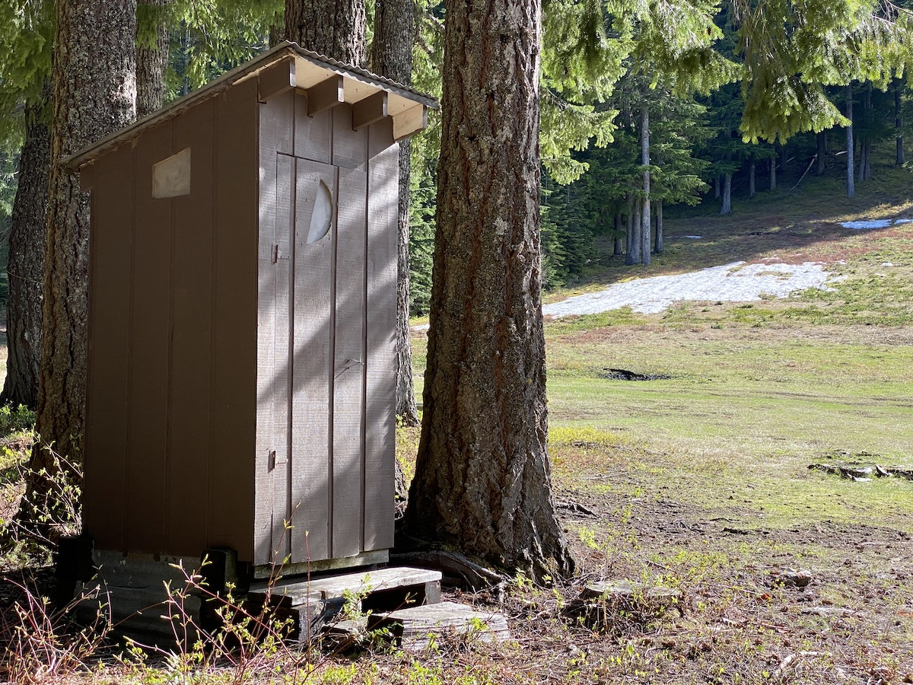

# One Holer

An outhouse.

### Location

Just south of the [Tow Hut](Tow-Hut), between [Mach](Mach) and [Turtle](Turtle).

### History

#### 1986

A skiers outhouse erected behind tow hut. [hr][]

[hr]: History-Reports "Meany History Reports, by Idona Kellogg"
